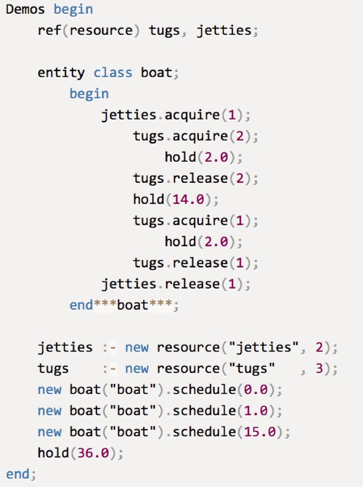

# Kotsim
A simple discrete event simulation framework based loosely on Demos from Simula. It is build to learn about how to make a co-routine framework in Kotlin more than it reflects an interest in discrete event simulation.

The code is an intellij project (not maven or gradle), and compiles with the `1.3-M2-release-IJ2018.2-1` plugin.

The simulation I wanted to mirror in Kotlin was this Simula program written using Birthwhistles Demos framework:



There are a number of aspects I would like to try and mirror somehow:

* Simple prefix `Demos` enable all parts to know how to work together. Notice how name binding is used to tie the parts together rather than passing explicit parameters. E.g. from within `boat` you refer to `jetties` and `tugs`, they are not passed as parameters to the boats.
* You do not have to explicitly start a simulation. The `Demos` prefix make that implicit.
* The `acquire` and `release` functions are defined on the relevant classes, and are not global.
* The `hold`, `acquire` and `release` functions completely hide the underlying scheduling.

## Jetties and tugs in Kitsim
Kotlin does not support prefixing, but it supports lambda's with reciever, and it allow a lambda to be written outside a call parameter.

```kotlin
fun main(args: Array<String>) = simulation {
    val jetty = resource(2, "Jetty") 
    val tug = resource(3, "Tug") 

    fun boat(start: Int, name: String = "") = simulationProcess(name) {
        hold(start)
        jetty.acquire( 1)
            tug.acquire( 2)
                hold(2)
            tug.release( 2)
            hold(14)
            tug.acquire( 1)
                hold(1)
            tug.release( 1)
        jetty.release(1)
    }
    // start three boats
    boat(0, "Boat1")
    boat(1, "Boat2")
    boat(7, "Boat3")
}
```

 In the code above, this allow me to have a function `simulation` which is defined as:

```kotlin
fun simulation(block: Simulation.() -> Unit) : Unit
``` 

## Lambda with receiver 
Notice the odd syntax `Simulation.() -> Unit`. This means that the block will be executed with a instance of Simulation as **`this`**. Simulation is an iterface: 

```kotlin
interface Simulation {
    val now: Time
    val current: SimulationProcess

    fun simulationProcess(name: String = "SimProcess", 
    			block: suspend SimulationProcess.() -> Unit): SimulationProcess
    fun resource(capacity: Int, name: String = "res") : Resource

    fun log(msg: String)
}
```

Because **`this`** is an instance implementing Simulation, it is possible to use the `resource`, and `simulationProcess` methods inside the main lambda.

This is used again in the `simulationProcess` method has a block which will have a `SimulationProcess` as **`this`**, enabling the use of the `hold` method

```kotlin
interface SimulationProcess {
    suspend fun hold(holdTime: Int)
}
```

### Implementing Lambda with reciever
When the lambda with reciever is invoked, you need to specify the object that will serve as **`this`**. It is done as:

```kotlin
fun simulation(block: Simulation.() -> Unit) {
    val simulation = SimulationClass()
    simulation.block()
    ...
}
```
The simulation method serves as a simple factory or builder method, and instantiates `SimulationClass`, the one implementation of the `Simulation` interface. The block can be invoked as if it was a method on `Simulation`. 

## Coroutines - SimulationProcess

